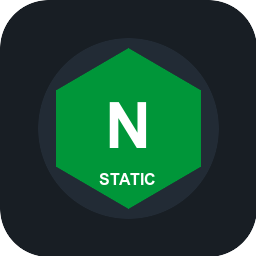

# 🌌 Custom Private Market para Cosmos-Server (Cosmos Cloud)

Repositório oficial/privado de receitas e **ServApps modulares** para o [Cosmos-Server](https://cosmos-cloud.io/). Este repositório atua como uma **Market Source** customizada, fornecendo *Runners* de deploy contínuo para múltiplos runtimes e stacks modernas com clonagem Git segura, montagem persistente e integração nativa ao Reverse Proxy e Smart Shield do Cosmos.

---

## 📦 Catálogo de ServApps Disponíveis

| Ícone | ServApp | Runtime / Versão | Stacks & Casos de Uso |
| :---: | :--- | :--- | :--- |
|  | **Node.js 24 Git Runner** | `node:24-alpine` | APIs, Next.js, Remix, Astro, Express, Fastify, NestJS (`npm`, `yarn`, `pnpm`). |
|  | **Python 3.13 Git Runner** | `python:3.13-slim` | FastAPI, Flask, Django, Uvicorn, Gunicorn com ambiente virtual `.venv` isolado. |
|  | **Golang 1.24 Git Runner** | `golang:1.24-alpine` | Microserviços compilados, APIs REST e gRPC com cache de módulos `go mod`. |
|  | **Static & SPA Nginx Runner** | `nginx:alpine` | SPAs (React, Vue, Vite, Svelte, Angular) e sites estáticos com roteamento SPA `try_files`. |
|  | **PHP 8.4 & Laravel Runner** | `php:8.4-apache` | Laravel, Symfony, WordPress, Composer e Apache com suporte a `.htaccess`. |
|  | **Rust Git Runner** | `rust:alpine` | Actix-web, Axum, Rocket com compilação release otimizada (`cargo build --release`). |

---

## 🚀 Como Adicionar esta Fonte ao Cosmos-Server

Para registrar este marketplace na sua instância do Cosmos:

1. Acesse o painel web do seu **Cosmos-Server**.
2. No menu lateral, navegue até **Market** > **Sources**.
3. Clique no botão **Add Source** (Adicionar Fonte).
4. Preencha os campos:
   - **Name**: `Custom Private Market`
   - **URL**: Insira a URL do repositório Git ou o link direto para o `index.json` (ex: `https://raw.githubusercontent.com/<SEU_USUARIO>/<SEU_REPOSITORIO>/main/index.json` ou a URL do Git).
5. Clique em **Save** / **Update Sources**.
6. Agora, ao abrir a aba **Market**, todos os novos ServApps estarão disponíveis para instalação com 1 clique!

---

## ⚙️ Parâmetros Configuráveis nos ServApps

Ao instalar qualquer ServApp deste catálogo através da interface do Cosmos, você terá acesso a um formulário guiado com os seguintes parâmetros:

| Variável | Descrição | Exemplo |
| :--- | :--- | :--- |
| `GIT_REPOSITORY_URL` | URL HTTPS do repositório a ser clonado | `https://github.com/org/meu-app.git` |
| `GIT_BRANCH` | Branch para deploy e sincronização | `main` (padrão) |
| `GITHUB_TOKEN` | Token de Acesso Pessoal (PAT) para repositórios privados | `ghp_xxxxxxxxxxxx` |
| `INSTALL_CMD` | Comando para instalar dependências | `npm install` / `pip install -r requirements.txt` |
| `BUILD_CMD` | Comando opcional de build/compilação | `npm run build` / `cargo build --release` |
| `START_CMD` | Comando executado para iniciar o servidor | `npm start` / `uvicorn main:app --host 0.0.0.0` |
| `APP_PORT` | Porta HTTP interna exposta pelo serviço | `3000` (Node), `8000` (Python), `8080` (Go/Rust), `80` (Nginx/PHP) |

---

## 🔐 Repositórios Privados (GitHub / GitLab / Bitbucket)

Para clonar repositórios privados sem expor chaves SSH no container:

1. Crie um **Personal Access Token (PAT)** no seu provedor Git:
   - **GitHub**: `Settings` > `Developer Settings` > `Personal access tokens` > `Fine-grained tokens` (permissão de *Contents: Read-only*).
   - **GitLab**: `Preferences` > `Access Tokens` (escopo `read_repository`).
2. No momento da instalação do ServApp no Cosmos, cole o token no campo **GitHub Personal Access Token (`GITHUB_TOKEN`)**.
3. O runner injeta automaticamente as credenciais seguras durante o `git clone` e `git pull`.

---

## 🔄 Ciclo de Vida & Execução Idempotente

Cada ServApp utiliza um script de inicialização projetado para execução idempotente e persistência de dados:

```text
Host Storage ({VOLUME_ROOT})
  └── /app                 <- Código clonado e dependências cacheadas
```

1. **Primeira Inicialização**:
   - Se o volume `/app` não contiver um repositório `.git`, o runner executa `git clone --branch <BRANCH>`.
   - Se nenhuma URL for informada, o runner inicializa uma aplicação demo de exemplo pronta para testar o proxy.
2. **Reinicializações do Container**:
   - Se o repositório já existir, o runner executa `git fetch` e `git pull`, garantindo que o container inicie sempre com a versão mais recente sem perder arquivos gerados.
3. **Build & Dependências**:
   - Dependências e caches de compilação ficam salvos no volume persistente `{VOLUME_ROOT}`, evitando downloads redundantes.
4. **Reverse Proxy & Smart Shield**:
   - Cada receita já declara a rota `routes` integrada ao Cosmos-Server, configurada com `mode: "PROXY"`, `useHost: true` e `smartShield: { "enabled": true }` para segurança anti-DDoS, rate-limiting e suporte nativo a 2FA/autenticação.

---

## 🛠️ Estrutura do Repositório

Para adicionar novos ServApps a esta loja, siga o padrão de diretórios:

```text
.
├── index.json                             # Catálogo central que indexa todos os apps
├── README.md                              # Guia de configuração e uso
├── test/
│   └── validate-market.test.mjs           # Validador de integridade e schemas JSON
└── apps/
    └── <identificador-do-app>/
        ├── cosmos-compose.json            # Definição do container, volumes, comandos e rotas
        ├── description.json               # Metadados, tags e formulário de parâmetros (UI)
        └── icon.png                       # Ícone visual (256x256 PNG)
```

---

## 🧪 Validação Automatizada

Para validar a integridade de todas as receitas e schemas antes de enviar novas alterações:

```bash
npm test
```

A suíte de testes verifica:
- Sintaxe e schemas de `index.json`, `description.json` e `cosmos-compose.json`.
- Existência e integridade física de todos os ícones e arquivos referenciados.
- Presença de volumes `{VOLUME_ROOT}` para persistência.
- Configuração de rotas de proxy reverso e Smart Shield.
- Lógica idempotente de scripts de inicialização.

---

## 📄 Licença

Distribuído sob a licença [MIT](LICENSE).
