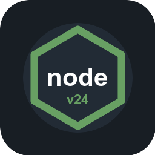
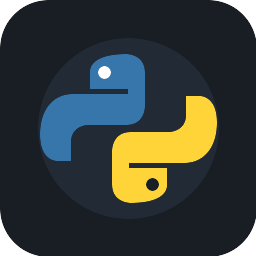
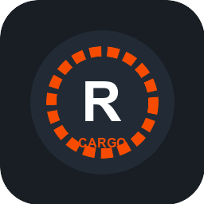

# 🌌 Custom Private Marketplace & App Store

Repositório unificado de receitas e **Git Runners modulares** com suporte simultâneo nativo para **Cosmos-Server (Cosmos Cloud)** e **ZimaOS / CasaOS (IceWhale)**. 

Atua como uma **Market Source** customizada e **Community App Store**, fornecendo ambientes de deploy contínuo para múltiplos runtimes com clonagem Git segura, montagem de volumes persistentes, isolamento de build e suporte a autenticação por Personal Access Token (PAT).

---

## 📦 Catálogo de ServApps & Runners Disponíveis

| Ícone | Runner / ServApp | Runtime / Imagem | Porta Padrão | Stacks & Casos de Uso |
| :---: | :--- | :--- | :---: | :--- |
|  | **Node.js 24 Git Runner** | `node:24-alpine` | `3000` | APIs, Next.js, Remix, Astro, Express, Fastify, NestJS (`npm`, `yarn`, `pnpm`). |
|  | **Python 3.13 Git Runner** | `python:3.13-slim` | `8000` | FastAPI, Flask, Django, Uvicorn, Gunicorn com ambiente virtual `.venv` persistente. |
|  | **Golang 1.24 Git Runner** | `golang:1.24-alpine` | `8080` | Microserviços compilados, APIs REST e gRPC com cache de módulos `go mod`. |
|  | **Static & SPA Nginx Runner** | `nginx:alpine` | `80` | SPAs (React, Vue, Vite, Svelte, Angular) e sites estáticos com roteamento SPA `try_files`. |
|  | **PHP 8.4 & Laravel Runner** | `php:8.4-apache` | `80` | Laravel, Symfony, WordPress, Composer e Apache com suporte a `.htaccess`. |
|  | **Rust Git Runner** | `rust:alpine` | `8080` | Actix-web, Axum, Rocket com compilação release otimizada (`cargo build --release`). |

---

## 🚀 Como Registrar esta Fonte nos Servidores

### 1️⃣ No Cosmos-Server (Cosmos Cloud)

1. Acesse o painel web do seu **Cosmos-Server**.
2. No menu lateral, navegue até **Market** > **Sources**.
3. Clique no botão **Add Source** (Adicionar Fonte).
4. Preencha os campos:
   - **Name**: `Custom Private Market`
   - **URL**: `https://raw.githubusercontent.com/LeoPersan/cosmos-custom-marketplace/main/index.json` (ou URL Git do repositório).
5. Clique em **Save** / **Update Sources**.
6. Acesse a aba **Market** e todos os ServApps estarão disponíveis com 1 clique, integrados ao Smart Shield e Reverse Proxy.

---

### 2️⃣ No ZimaOS / CasaOS (IceWhale)

1. Acesse o painel web do seu **ZimaOS** ou **CasaOS**.
2. Abra a **App Store**.
3. Clique em **Community Store** / ícone de engrenagem no canto superior da App Store.
4. Clique no botão **"+"** (Adicionar Fonte).
5. Cole a URL do manifesto `store.json`:
   ```text
   https://raw.githubusercontent.com/LeoPersan/cosmos-custom-marketplace/main/store.json
   ```
6. Clique em **Salvar** / **Submit**.
7. Todos os runners aparecerão catalogados nas categorias *Development* e *Utilities*, prontos para deploy com formulário de configuração visual.

> 💡 **Dica (Instalação Avulsa)**: Caso queira instalar um runner avulso sem adicionar a loja inteira, você pode utilizar o botão **Custom Install** na App Store do ZimaOS e colar o conteúdo de qualquer arquivo [`Apps/<app>/docker-compose.yml`](Apps/).

---

## ⚙️ Parâmetros Configuráveis nos Runners

Ao instalar qualquer runner em qualquer um dos servidores, os seguintes parâmetros podem ser ajustados:

| Variável | Descrição | Exemplo | Padrão |
| :--- | :--- | :--- | :--- |
| `GIT_REPOSITORY_URL` | URL HTTPS do repositório a ser clonado | `https://github.com/org/meu-app.git` | `""` (inicia com app demo) |
| `GIT_BRANCH` | Branch para deploy e sincronização | `main` | `main` |
| `GITHUB_TOKEN` | Token de Acesso Pessoal (PAT) para repositórios privados | `ghp_xxxxxxxxxxxx` | `""` |
| `INSTALL_CMD` | Comando para instalar dependências | `npm install` / `pip install -r requirements.txt` | Específico por runtime |
| `BUILD_CMD` | Comando opcional de build/compilação | `npm run build` / `cargo build --release` | `""` |
| `START_CMD` | Comando executado para iniciar o servidor | `npm start` / `uvicorn main:app --host 0.0.0.0` | Específico por runtime |
| `APP_PORT` | Porta HTTP interna da aplicação | `3000`, `8000`, `8080`, `80` | Porta padrão do runtime |

---

## 🔐 Repositórios Privados (GitHub / GitLab / Bitbucket)

Para clonar repositórios privados com segurança:

1. Crie um **Personal Access Token (PAT)** no seu provedor Git:
   - **GitHub**: `Settings` > `Developer Settings` > `Personal access tokens` > `Fine-grained tokens` (permissão *Contents: Read-only*).
   - **GitLab**: `Preferences` > `Access Tokens` (escopo *read_repository*).
2. Cole o token no campo **`GITHUB_TOKEN`** durante a instalação.
3. O runner injeta automaticamente as credenciais durante `git clone` e `git pull` sem salvar chaves permanentes no container.

---

## 🔄 Ciclo de Vida & Execução Idempotente

```text
Host Storage (Volume Persistente)
  └── /app                 <- Código clonado, virtualenvs e dependências cacheadas
```

1. **Primeira Inicialização**:
   - Se o volume `/app` não contiver `.git`, o runner clona a branch especificada.
   - Se nenhuma URL for informada, inicializa uma aplicação demo para testes rápidos.
2. **Reinicializações**:
   - Executa `git fetch` e `git pull`, garantindo que o container inicie com a versão mais recente sem apagar caches locais.
3. **Build & Dependências**:
   - As dependências e módulos de compilação permanecem persistidos no volume.

---

## 🛠️ Estrutura do Repositório

```text
.
├── Apps/                                   # Loja ZimaOS / CasaOS (v2 Compose + x-casaos)
│   ├── nodejs-git-runner/
│   │   ├── docker-compose.yml
│   │   └── icon.png
│   └── ...
├── servapps/                               # Fonte Cosmos-Server (JSON recipes)
│   ├── nodejs-git-runner/
│   │   ├── cosmos-compose.json
│   │   ├── description.json
│   │   └── icon.png
│   └── ...
├── store.json                              # Manifesto raiz ZimaOS v2
├── category-list.json                      # Categorias ZimaOS
├── recommend-list.json                     # Apps recomendados ZimaOS
├── servapps.json                           # Manifesto Cosmos (lista de ServApps)
├── index.json                              # Catálogo central Cosmos (showcase + all)
├── build.js                                # Compilador unificado dual-target
├── test/
│   └── validate-market.test.mjs            # Suíte de testes automatizados caixa-preta
└── README.md
```

---

## 🧪 Compilação & Validação Automatizada

Para compilar e validar os catálogos de ambos os servidores:

```bash
# Compilar e sincronizar os catálogos Cosmos e ZimaOS
npm run build

# Executar suíte de testes de integridade e conformidade de schemas
npm test
```

A suíte de testes verifica:
- Conformidade dos schemas Cosmos (`index.json`, `servapps.json`, `cosmos-compose.json`).
- Conformidade dos schemas ZimaOS (`store.json`, `category-list.json`, `docker-compose.yml` com `x-casaos`).
- Paridade de 100% dos 6 runners em ambos os ecossistemas.
- Integridade física de todos os ícones e arquivos referenciados.

---

## 📄 Licença

Distribuído sob a licença [MIT](LICENSE).
